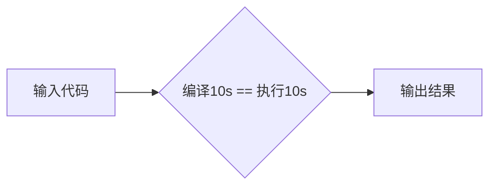
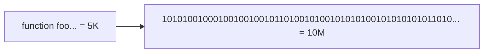
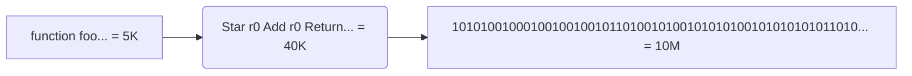

---
# try also 'default' to start simple
theme: seriph
# random image from a curated Unsplash collection by Anthony
# like them? see https://unsplash.com/collections/94734566/slidev
background: https://source.unsplash.com/collection/94734566/1920x1080
# apply any windi css classes to the current slide
class: "text-center"
# https://sli.dev/custom/highlighters.html
highlighter: shiki
# show line numbers in code blocks
lineNumbers: true
# some information about the slides, markdown enabled
info: |
  ## Slidev Starter Template
  Presentation slides for developers.

  Learn more at [Sli.dev](https://sli.dev)
# persist drawings in exports and build
drawings:
  persist: false
---

# V8 in Browser

[@zhang13pro](https://github.com/zhang13pro)

<div class="pt-12">
  <span @click="$slidev.nav.next" class="px-2 py-1 rounded cursor-pointer" hover="bg-white bg-opacity-10">
    Next() <carbon:arrow-right class="inline"/>
  </span>
</div>

<div class="abs-br m-6 flex gap-2">
  <button @click="$slidev.nav.openInEditor()" title="Open in Editor" class="text-xl icon-btn opacity-50 !border-none !hover:text-white">
    <carbon:edit />
  </button>
  <a href="https://github.com/zhang13pro/presentation-v8" target="_blank" alt="GitHub"
    class="text-xl icon-btn opacity-50 !border-none !hover:text-white">
    <carbon-logo-github />
  </a>
</div>

<!--
The last comment block of each slide will be treated as slide notes. It will be visible and editable in Presenter Mode along with the slide. [Read more in the docs](https://sli.dev/guide/syntax.html#notes)
-->

---

# V8 怎么运行 JavaScript 代码

<v-clicks>


### 函数的本质

函数是特殊的对象

隐藏属性

- name
- code
- prototype
- [[prototype]]

</v-clicks>

<!-- 如果某个编程语言的函数可以和它的数据类型做一样的事情，我们就把这个语言中的函数称为一等公民。

JavaScript 中的对象就是由一组一组属性和值组成的集合，既然函数也是对象，那么函数也是由一组组值和属性组成的集合

函数之所以成为特殊的对象，这个特殊的地方是函数可以“被调用”，所以一个函数被调用时，它还需要关联相关的执行上下文。
-->

---

# 在 V8 中访问对象属性

常规属性 (properties) 和排序属性 (element)

```js
function Foo() {
  this[100] = "test-100";
  this[1] = "test-1";
  this["B"] = "bar-B";
  this[50] = "test-50";
  this[9] = "test-9";
  this[8] = "test-8";
  this[3] = "test-3";
  this[5] = "test-5";
  this["A"] = "bar-A";
  this["C"] = "bar-C";
}
var bar = new Foo();
for (key in bar) {
  console.log(`index:${key} value:${bar[key]}`);
}
```

<v-click>

查找过程将多一步操作

</v-click>

<!--
数字属性应该按照索引值大小升序排列，字符串属性根据创建时的顺序升序排列。

在 V8 内部，为了有效地提升存储和访问这两种属性的性能，分别使用了两个**线性数据结构**(数组对象)来分别保存排序属性和常规属性

如果执行索引操作，那么 V8 会先从 elements 属性中按照顺序读取所有的元素，然后再在 properties 属性中读取所有的元素，这样就完成一次索引操作。

 -->

---

## 对象中的隐藏属性

- 对象内属性 (in-object properties)
- 快属性--线性结构--查找快
  - element
  - properties
- 慢属性--非线性结构 (字典)--修改快
  - properties 对象属性增多时降级
- map--隐藏类

<!-- 不过对象内属性的数量是固定的，默认是 10 个，如果添加的属性超出了对象分配的空间，则它们将被保存在常规属性存储中。虽然属性存储多了一层间接层，但可以自由地扩容。

通常，我们将保存在线性数据结构中的属性称之为“快属性”，因为线性数据结构中只需要
通过索引即可以访问到属性，虽然访问线性结构的速度快，但是如果从线性结构中添加或者
删除大量的属性时，则执行效率会非常低，这主要因为会产生大量时间和内存开销。

-->

---

# V8 的宿主环境

运行时环境

- 数据存储空间：堆空间和栈空间
- 全局执行上下文和全局作用域
  - 词法环境
  - 变量环境
  - this
- 事件循环系统

<!-- 要执行 V8，则需要有一个宿主环境，宿主环境可以是浏览器中的渲染进程，可以是 Node.js 进程, 也可以是其他的定制开发的环境，而这些宿主则提供了很多V8 执行 JavaScript 时所需的基础功能部件


V8 并不是一个完整的系统，所以在执行时，它的一部分基础环境是由宿主提供的，这包括了全局执行上下文、事件循环系统，堆空间和栈空间。除了需要宿主提供的一些基础环境之外，

V8 自身会提供JavaScript 的核心功能和垃圾回收系统。

CPU 执行机器代码的逻辑非常简单，首先编译之后的二进制代码被加载进内存，然后 CPU就按照指令的顺序，一行一行地执行。


 -->

---

# 栈溢出

是否存在堆栈溢出错误?

<v-clicks>

```js
function foo() {
  foo();
}
foo();
```

```js
function foo() {
  setTimeout(foo, 0);
}
foo();
```

```js
function foo() {
  return Promise.resolve().then(foo);
}
foo();
```

</v-clicks>

---

## 为什么使用栈管理函数调用

<div class='mt-4'>

1. 可以被调用
1. 具有作用域机制

</div>

<v-clicks>

观察下面函数的执行流程 👇

```js {14|11|5|2|6|all}
function getZ() {
  return 4;
}
function add(x, y) {
  let z = getZ();
  return x + y + z;
}
function main() {
  let x = 5;
  let y = 6;
  let ret = add(x, y);
}

main();
```

函数的生命周期和资源分配符合 _LIFO_

</v-clicks>

<!-- 第一个特点是函数可以被调用，你可以在一个函数中调用另外一个函数，当函数调用发
生时，执行代码的控制权将从父函数转移到子函数，子函数执行结束之后，又会将代码
执行控制权返还给父函数；
1.
第二个特点是函数具有作用域机制，所谓作用域机制，是指函数在执行的时候可以将定
义在函数内部的变量和外部环境隔离，在函数内部定义的变量我们也称为临时变量，临
时变量只能在该函数中被访问，外部函数通常无权访问，当函数执行结束之后，存放在
内存中的临时变量也随之被销毁。 -->

---

## 栈如何管理函数调用

<div class='mt-4'>

1. `let`，临时变量压入栈
1. `()`，控制权转移
1. `return`，恢复现场

</div>

<v-clicks>

<div class="mt-4 text-2xl">如何恢复</div>

<div class='mt-4'>

- esp 寄存器保存栈顶指针
- ebp 寄存器保存栈帧指针（当前函数起始位置）

</div>
</v-clicks>

<!-- 将 esp 的指针向下移动到之前 main 函数执行时的地方就可以，不过新的问题又来了，CPU 是怎么知道要移动到这个地址呢？ -->

---

## 有了栈为什么还要堆

<v-clicks class='mt-10'>

- 栈空间连续
- 操作速度快
- 空间大小有限

</v-clicks>

<!-- 因为栈空间是有限的，这就导致我们在编写程序的时候，经常一不小心就会导致栈溢出，比
如函数循环嵌套层次太多，或者在栈上分配的数据过大，都会导致栈溢出，基于栈不方便存
放大的数据，因此我们使用了另外一种数据结构用来保存一些大数据，这就是堆。 -->

---

# V8 如何实现闭包

<v-clicks>

### 惰性解析

JavaScript 三特性

<div>
1. JavaScript 语言允许在函数内部定义新的函数
</div>

<div class='mt-2'>
2. 可以在内部函数中访问父函数中定义的变量
</div>

<div class='mt-2'>
3. 因为函数是一等公民，所以函数可以作为返回值
</div>

</v-clicks>

<!-- 所谓惰性解析是指解析器在解析的过程中，如果遇到函数声明，那么会跳过函数内部的代码，并不会为其生成
AST 和字节码，而仅仅生成顶层代码的 AST 和字节码。惰性解析可以加速 JavaScript 代码的启动速度，如果要将所有的代码一次性解析编译完成，那么会大大增加用户的等待时间。


闭包内的变量不能随着执行上下文被销毁，V8 如何处理呢？
-->

---

## 如何解决闭包带来的问题

<v-clicks>

<div class='mt-4 text-2xl'>预解析器</div>

<div class='mt-4'>
1. 判断当前函数是不是存在一些语法上的错误
</div>
<div class='mt-4'>
2. 是检查函数内部是否引用了外部变量
</div>

<div class='mt-8'>下面代码的变量 a 是存在栈还是堆内存中？</div>

<div grid='~ cols-2 gap-4' class='mt-4'>

```js
function foo() {
  var a = 0;
}
```

```js
function foo() {
  var a = 0;
  return function inner() {
    return a++;
  };
}
```

</div>
</v-clicks>

<!--
如果引用了外部的变量，预解析器会将栈中的变量复制到堆中，在下次执行到该函数的时候，直接使用堆中的引用，这样就解决了闭包所带来的问题。
-->

---

# V8 早期编译流程

<div grid='~ cols-2 gap-4'>

<v-clicks>


<div class='mt-12 ml-8'>

1. 没有中间的字节码
1. 两个编译器

</div>
</v-clicks>

</div>

<style>
  img{
    height: 28vh;
  }
</style>

<!-- 早期的 V8 之所以抛弃中间形式的代码，直接将 JavaScript 代码编译成机器代码，是因为
机器代码的执行性能非常高效，但是最新版本却朝着执行性能相反的方向进化，那么这是出
于什么原因呢？ -->

---

## 为什么又引入字节码

<v-clicks>

<div grid='~ cols-2 gap-4'>



1. 将编译后的二进制代码缓存在内存中（in-memory cache）
2. 当浏览器退出时，缓存编译后的二进制代码到磁盘上

</div>

<div class="mt-8 mb-4">
二进制代码所占用的内存空间是 JavaScript 代码的十几倍 🤨
</div>



<div class="mt-8 mb-4">
字节码虽然占用的空间比原始的 JavaScript 多，但是相较于机器代码还是小了太多 ✅
</div>



由此可见，使用字节码能降低内存消耗；此外之外，还提升启动速度、降低代码复杂度

</v-clicks>

---

## 字节码解决了哪些问题

<v-clicks>

- 解释器可以快速生成字节码，但解释器执行字节码需要更长的时间。
- 引入了字节码，就可以统一将字节码转换为不同平台的二进制代码。
- 解决启动问题：生成字节码的时间很短；
- 解决空间问题：字节码占用内存不多，缓存字节码会大大降低内存的使用；
- 代码架构清晰：采用字节码，可以简化程序的复杂度，使得 V8 移植到不同的 CPU 架构
  平台更加容易。

</v-clicks>

<!-- 1. 解释器可以直接解释执行字节码
1. 优化编译器可以将字节码编译为二进制代码，然后再执行二进制机器代码 -->

---

# 如何在内存中快速查找对象属性

静态语言效率更高

<div grid='~ cols-2 gap-4'>

```js
let point = {
  x: 100,
  y: 100,
};
```

```c
struct Point{
  int x;
  int y;
}
Point start;
start.x = 100;
start.y = 100;
```

</div>

<v-click>

假设

- 对象创建好了之后就不会添加新的属性；
- 对象创建好了之后也不会删除属性。

</v-click>

<!-- 静态语言中，可以直接通过偏移量查询来查询对象的属性值，这也就是静态语言的执行效率高的一个原因。 -->

---

## 隐藏类（Hiden Class）

<v-clicks>

1. 对象中所包含的所有的属性；
1. 每种类型相对于对象的偏移量。

```js
let point = {
  x: 100,
  y: 100,
};
```


</v-clicks>

<style>
  img{
    height: 28vh;
  }
</style>

<!-- V8 会为每个对象创建一个隐藏类，对象的隐藏类中记录了该对象一些基础的布局信息

将动态语言静态化的一个操作，V8 通过引入隐藏类，模拟 C++ 这种静态语言的机
制，从而达到静态语言的执行效率。

-->

---

## 隐藏类复用

<v-clicks>

形状相同的对象 🕵️‍♂️

1. 相同的属性名称；
1. 相等的属性个数。

```js
let point = { x: 100, y: 200 };
let point2 = { x: 3, y: 4 };
```

<div grid='~ cols-2 gap-4'>


<div>

最佳实践

1. 使用字面量初始化对象时，要保证属性的顺序是一致的。
1. 尽量使用字面量一次性初始化完整对象属性。
1. 尽量避免使用 delete 方法。

</div>

</div>

</v-clicks>

<style>
  img{
    height: 28vh;
  }
</style>

<!--
V8 会为每个对象分配一个隐藏类，
有了隐藏类，V8 就可以根据隐藏类中描述的偏移地址获取对应的属性
值，这样就省去了复杂的查找流程。


在执行过程中：如果对象的形状没有发生改变，那么该对象就会一直使用该隐藏类；
如果对象的形状发生了改变，那么 V8 会重建一个新的隐藏类给该对象。 -->

---

## 内联缓存（Inline Cache）

<v-clicks>

```js
function loadX(o) {
  return o.x;
}
var o = { x: 1, y: 3 };
var o1 = { x: 3, y: 6 };
for (var i = 0; i < 90000; i++) {
  loadX(o);
  loadX(o1);
}
```

1. 查找对象 o 的隐藏类，
1. 再通过隐藏类查找 x 属性偏移量，
1. 然后根据偏移量获取属性值

1、缓存什么？

**调用点 (CallSite)** 上的关键的中间数据

2、缓存在哪？

**反馈向量 (FeedBack Vector)**，表结构，其中每一项称为一个**插槽（Slot）**

</v-clicks>

---

## 反馈向量（FeedBack Vector）


<v-click>

type

- 存储 (STORE) 类型的操作 `o.y=13`
- 调用 (CALL) 类型的操作 `foo()`
- 加载 (LOAD) 类型的操作 `o.x`

</v-click>

---

### 多态和超态

<v-clicks>

反馈向量还存储了每个插槽的状态（state）信息

- 单态（monomorphic）：一个插槽中只包含 1 个隐藏类
- 多态（polymorphic）：一个插槽中包含了 2 ～ 4 个隐藏类
- 超态（magamorphic）：一个插槽中超过 4 个隐藏类

```js
function loadX(o) {
  return o.x;
}
var o = { x: 1, y: 3 };
var o1 = { x: 3, y: 6, z: 4 };
for (var i = 0; i < 90000; i++) {
  loadX(o);
  loadX(o1);
}
```

对象 o 和 o1 的形状是不同的，这意味着 V8 为它们创建的隐藏类（map）也是不同的。这就形成了多态。

_单态的性能优于多态和超态_

</v-clicks>

<!-- 虽然我们分析的隐藏类和 IC 能提升代码的执行速度，但是在实际的
项目中，影响执行性能的因素非常多，找出那些影响性能瓶颈才是至关重要的，你不需要过
度关注微优化，你也不需要过度担忧你的代码是否破坏了隐藏类或者 IC 的机制，因为相对
于其他的性能瓶颈，它们对效率的影响可能是微不足道的。 -->

---

# 事件循环

<v-clicks>

### V8 如何实现回调函数

同步回调和异步回调

<div grid='~ cols-2 gap-4'>

```js
var myArray = ["water", "goods", "123", "like"];
function handlerArray(indexName, index) {
  console.log(index + ". " + indexName);
}
myArray.forEach(handlerArray);
```

```js
function foo() {
  alert("Hello");
}
setTimeout(foo, 3000);
```

</div>

异步回调什么时机、在什么位置被调用？

</v-clicks>

<!-- 同步回调函数是在执行函数内部被执行的，而异步回调函数是在执行函数外部被执行的。

-->

---

## UI 主线程

<v-clicks>


```js
function UIMainThread() {
  while (queue.waitForMessage()) {
    const task = queue.getNext();
    processNextMessage(task);
  }
}
```

</v-clicks>

<style>
  img{
    height: 30vh;
  }
</style>

<!-- 我们把 UI 线程每次从消息队列中取出事件，执行事件的过程称为一个任务

这就是通用的 UI 线程的结构，有消息队列，通过鼠标、键盘、触控板等产生的消息都会被
添加进消息队列，主线程会循环地从消息队列中取出消息并执行。

关于异步回调，也有两种不同的类型，其典型代表是 setTimeout 和
XMLHttpRequest。

setTimeout 的执行流程其实是比较简单的，在
setTimeout 函数内部封装回调消息，并将回调消息添加进消息队列，然后主线程从消息队
列中取出回调事件，并执行

XMLHttpRequest 稍微复杂一点，因为下载过程需要放到单独的一个线程中去执行，所以
执行 XMLHttpRequest.send 的时候，宿主会将实际请求转发给网络线程，然后 send 函
数退出，主线程继续执行下面的任务。网络线程在执行下载的过程中，会将一些中间信息和
回调函数封装成新的消息，并将其添加进消息队列中，然后主线程从消息队列中取出回调事
件，并执行回调函数。


-->

---

# V8 如何实现微任务

- 宏任务：消息队列中的等待被主线程执行的事件
- 微任务：一个需要异步执行的函数

<v-click>


</v-click>

<!-- 微任务的执行时机是在主函数执行结束之后、当前宏任务结束之前。 -->

---

## 调用栈|主线程|消息队列

<v-clicks>

- 调用栈管理主线程上的函数调用
- 微任务在当前宏任务调用栈的全局执行上下文中

Let's see it one more time!

<div grid='~ cols-3 gap-4'>

```js
function foo() {
  foo();
}
foo();
```

```js
function foo() {
  setTimeout(foo, 0);
}
foo();
```

```bash
function foo() {
  return Promise.resolve()
  .then(foo);
}
foo();
```

</div>

思考：浏览器中的 MutationObserver 接口为什么要使用微任务？

</v-clicks>

<!-- 调用栈是一种数据结构，用来管理在主线程上执行的函数的调用关系

微任务可以在实时性和效率之间做有效的权衡

V8 会为每个宏任务维护一个微任务队列。当 V8 执行一段 JavaScript 时，会
为这段代码创建一个环境对象，微任务队列就是存放在该环境对象中的。当你通过
Promise.resolve 生成一个微任务，该微任务会被 V8 自动添加进微任务队列，等整段代码
快要执行结束时，该环境对象也随之被销毁，但是在销毁之前，V8 会先处理微任务队列中
的微任务。

-->

---

# V8 是如何实现 async/await 的？

<v-clicks>

回调既地狱

Promise

Generator（协程）+ 执行器（co）

async/await

async 是一个通过**异步执行并隐式返回 Promise** 作为结果的函数

await 等待的是一个 Promise 对象

提问：co 的运行原理是什么？

</v-clicks>

<!-- 回调造成代码逻辑非线性，不易理解

使用 Promise 可以解决回调地狱中编码不线性的问题

更加线性的编码方式：执行到异步请求的时候，暂停当前函数，等异步请求返回了结果，再恢复该函数。


在生成器内部，如果遇到 yield 关键字，那么 V8 将返回关
键字后面的内容给外部，并暂停该生成器函数的执行。生成器暂停执行后，外部的代码便开
始执行，外部代码如果想要恢复生成器的执行，可以使用 result.next 方法。

生成器依然需要使用额外的 co 函数来驱动生成器函数的执行，这一点非常不友好。
async/await改进了生成器的缺点，提供了在不阻塞主线程的情况下使用同步代码实现异步访问资源的能力

await 等待的是一个 Promise 对象，它就会暂停执行生成器函数，直到 Promise 对
象的状态变成 resolve/reject，才会恢复执行，然后得到的值作为 await 表达式的运算结果。

-->

---

# V8 的垃圾回收机制

GC 流程

<v-click>

GC Root + reachability

</v-click>

<v-click>

1. GC Root 标记

- 全局的 window 对象（位于每个 iframe 中）；
- 文档 DOM 树，由可以通过遍历文档到达的所有原生 DOM 节点组成；
- 存放栈上变量。

</v-click>

<v-click>

2. 清理 unreachable

</v-click>

<v-click>

3. 整理**内存碎片**

</v-click>

<!--
GC Root 对象：初始存活的对象的集合

可访问性（reachability）算法：判断活动对象和非活动对象
 -->

---

## 代际假说（The Generational Hypothesis）

<v-clicks>

- 大部分对象都是“朝生夕死”的
- 不死的对象，会活得更久

<!-- 主垃圾回收器 **Major GC**，主要负责老生代的垃圾回收。 -->

副垃圾回收器 **Minor GC (Scavenger)**，主要负责新生代的垃圾回收。


为了执行效率，一般新生区的空间会被设置得比较**小**

副垃圾回收器还会采用**对象晋升**策略

</v-clicks>

<style>
  img{
    height: 29vh;
  }
</style>

<!-- 代际假说是垃圾回收领域中一个重要的术语，同样适合Java、Python

如果我们只使用一个垃圾回收器，在优化大多数新对象的同时，就很难优化到那些老对象，
因此你需要权衡各种场景，根据对象生存周期的不同，而使用不同的算法，以便达到最好的
效果。

新生代通常只支持 1～8M 的容量，而老生代支持的容量就大很多了。新生代中存放的是生存时间短的对象，老生代中存放生存时间久的对象。

Scavenger-Compact：首先对对象区域中的垃圾做标记；标记完成之后，就进入垃圾清理阶段。副垃圾回收器会把这些存活的对象复制到空闲区域中，同时它还会把这些对象有序地排列起来，所以这个**复制**过程，也就相当于完成了内存**整理**操作，复制后空闲区域就没有内存碎片了。

完成复制后，对象区域与空闲区域进行角色**翻转**，也就是原来的对象区域变成空闲区域，原来的空闲区域变成了对象区域。这样就完成了垃圾对象的回收操作，同时，这种**角色翻转的操作还能让新生代中的这两块区域无限重复使用下去**。

对象晋升策略，也就是移动那些经过两次垃圾回收依然还存活的对象到老生代中
 -->

---

## 主垃圾回收器

<v-clicks>

标记 - 清除（Mark-Sweep）

1. 标记
1. 直接清除

标记 - 整理（Mark-Compact）

```js
function strToArray(str) {
  let i = 0;
  const len = str.length;
  let arr = new Uint16Array(str.length);
  for (; i < len; ++i) {
    arr[i] = str.charCodeAt(i);
  }
  return arr;
}
function foo() {
  let i = 0;
  let str = "test V8 GC";
  while (i++ < 1e5) strToArray(str);
}
// V8 执行这段代码的过程中，产生了哪些垃圾数据。站在内存空间和主线程资源的角度来分析，如何优化这段代码;
foo();
```

</v-clicks>

<!--
对一块内存多次执行标记 -清除算法后，会产生大量不连续的内存碎片。

Mark-Compact 后续步骤不是直接对可回收对象进行清理，而是让所有存活的对象都向一端移动，然后直接清理掉这一端之外的内存。 -->

---

## GC 优化

<v-clicks>

全停顿（Stop-The-World）

方法论 ✍️

1. 将一个完整的垃圾回收的任务拆分成多个小的任务
1. 将标记对象、移动对象等任务转移到后台线程进行

实践论 📌

- 并行(Parallel)回收
- 增量回收
- 并发(concurrent)回收

</v-clicks>

<!-- 向现有的垃圾回收器添加并行、并发和增量等垃圾回收技术 -->

---

## 并行（Parallel）回收

<v-clicks>

开启多个协助线程，同时执行同样的回收工作


仍然属于全停顿 GC

</v-clicks>

<!-- V8 的副垃圾回收器所采用的就是并行策略，它在执行垃圾回收的过程中，启动了多个线程来负责新生代中的垃圾清理操作，这些线程同时将对象空间中的数据移动到空闲区域。由于数据的地址发生了改变，所以还需要同步更新引用这些对象的指针。 -->

---

## 增量回收

<v-clicks>


增量回收是并发的（concurrent）

1. 三色标记法
1. 写屏障 (Write-barrier)

降低主线程处理任务的吞吐量 (throughput)

</v-clicks>

<!--
要实现增量执行，需要满足两点要求：

1.垃圾回收可以被随时暂停和重启，暂停时需要保存当时的扫描结果，等下一波垃圾回收来了之后，才能继续启动。

2.在暂停期间，被标记好的垃圾数据如果被 JavaScript 代码修改了，那么垃圾回收器需要能够正确地处理。


1.黑色表示这个节点被 GC Root 引用到了，而且该节点的子节点都已经标记完成了 ;

2.灰色表示这个节点被 GC Root 引用到，但子节点还没被垃圾回收器标记处理，也表明目前正在处理这个节点；(暂停后GC复位到灰色地)

3.白色表示这个节点没有被访问到，如果在本轮遍历结束时还是白色，那么这块数据就会被收回。


写屏障 (Write-barrier) 机制实现这个约束条件--不能让黑色节点指向白色节点。所以在 V8 中，每次执行如 window.a.b = value的写操作之后，V8 会插入写屏障代码，强制将 value 这块内存标记为灰色。
-->

---

## 并发 (concurrent) 回收

<v-clicks>


- 当主线程执行 JavaScript 时，堆中的内容随时都有可能发生变化，从而使得辅助线程之前做的工作完全无效；
- 主线程和辅助线程极有可能在同一时间去更改同一个对象，这就需要额外实现读写锁的一些功能了。

</v-clicks>

<!-- 所谓并发回收，是指主线程在执行 JavaScript 的过程中，辅助线程能够在后台完成执行垃圾回收的操作。 -->

---

## 几种内存问题

<v-clicks>

1. 内存泄漏 (Memory leak)，它会导致页面的性能越来越差；
   - 意外声明全局变量
   - 滥用闭包
   - "detached"节点
1. 内存膨胀 (Memory bloat)，它会导致页面的性能会一直很差；
1. 频繁垃圾回收，它会导致页面出现延迟或者经常暂停。

```bash
function strToArray(str) {
  let i = 0, len = str.length;
  let arr = new Uint16Array(str.length);
  for (; i < len; ++i) arr[i] = str.charCodeAt(i);
  return arr;
}
function foo() {
  let i = 0;
  let str = "test V8 GC";
  while (i++ < 1e5) strToArray(str);
}
foo();
```

这段代码就会频繁创建临时变量，这种方式很快就会造成新生代内存内装满，从而频繁触发垃圾回收。

</v-clicks>

<!-- 为了解决频繁的垃圾回收的问题，可以考虑将临时变量设置为全局变量。 -->
